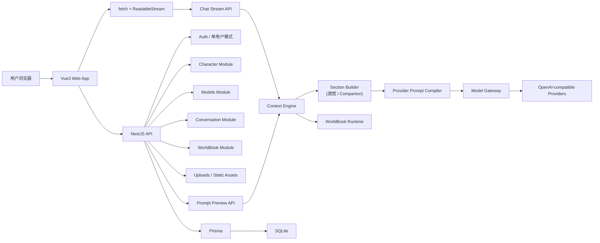

# Tavern Lite 开发约束

本文件是 Tavern Lite 项目唯一的常驻开发规则与架构说明，合并自原 `AGENTS.md` 与 `docs/architecture.md`，并按项目当前实际状态更新。供 Codex、Claude Code 和人工开发者在后续阶段共同遵守。后续任务如未明确要求修改本文件，应把本文件视为项目边界、实现约束与架构事实的来源。

其他文档（README、各设计文档）若与本文件冲突，以本文件为准。

## 1. 项目目标与定位

Tavern Lite 是一个轻量级 AI 酒馆 / 角色对话 Web MVP，面向个人和少量朋友使用，自托管、单机部署。

项目包含两个相互隔离的产品形态：

- **酒馆角色对话（核心 MVP）**：可切换、可导入导出的角色卡，配合世界书、Persona、模型链进行角色扮演式对话。
- **AI 角色形态（扩展分支）**：独立的 AI 女友 / 长期陪伴产品区；角色本身就是唯一、持续的关系线程，不含会话层。使用独立数据模型、Prompt Builder、聊天闭环和前端路由。详见 [§17 AI 角色形态分支](#17-ai-角色形态分支) 与 [长期陪伴设计](docs/conversation-long-term-memory.md)。

酒馆 MVP 的首版闭环：

1. 创建或选择角色。
2. 配置模型与参数。
3. 创建会话并发送用户消息。
4. 后端基于角色卡、用户 Persona、世界书命中、历史消息和输出约束构建 Prompt。
5. 通过 Model Gateway 调用 OpenAI-compatible 模型。
6. 使用 `POST /api/chat/stream` 返回 SSE 格式流。
7. 保存用户消息与 assistant 回复。
8. 支持基础管理、导入导出、备份恢复和单机部署。

项目不是大规模 SaaS，不追求支付、市场、机器人、多端包装、TTS、图片生成、向量数据库或高并发架构。

## 2. 技术栈边界

固定技术栈：

- 前端：Vue 3、Vite、TypeScript、Pinia、Vue Router、Naive UI。
- 后端：NestJS、TypeScript、Prisma、SQLite。
- 通信：REST API + `fetch` 读取 `ReadableStream`。
- 流式格式：服务端输出 `text/event-stream` 帧，前端自行解析。
- 模型接入：OpenAI-compatible Chat Completions 优先，通过后端 Model Gateway 适配。
- 部署目标：单机 Web 服务，已提供 Docker Compose（`server` / `web` / `share-web` 三容器 + nginx 反代），见 [docs/deploy.md](docs/deploy.md)。

未经明确任务要求，不引入以下内容：

- Redis、队列系统、向量数据库、全文检索引擎、embedding、RAG。
- 支付、公开市场、创作者收益、多租户 SaaS。
- 机器人平台、TTS、图片生成。
- 桌面端、小程序、移动 App、浏览器插件。
- 大型状态机、微服务、插件市场、复杂后台权限系统。

关于长期记忆：酒馆 Prompt 构建路径永远不含 `companion_memory` / `companion_style` / `companion_runtime_state` 等 Companion 专属 section。长期记忆仅属于独立 AI 角色形态，按 `Companion.id` 隔离、默认关闭、显式开启；它不能写回酒馆角色卡、Persona、世界书或酒馆会话（见 [§17](#17-ai-角色形态分支)）。

## 3. 目录结构

```text
.
├── AGENTS.md                 # 本文件：唯一规则与架构来源
├── README.md                 # 项目说明与启动方式
├── docs/                     # 当前架构、运维与验收文档
├── apps/
│   ├── web/                  # Vue3 + Vite 前端
│   ├── share-web/            # 独立公共分享聊天前端，只暴露 /s/:token
│   └── server/               # NestJS 后端
├── packages/
│   └── shared/               # 前后端共享类型、常量、工具
├── prisma/
│   ├── schema.prisma
│   └── migrations/
├── scripts/                  # 构建、备份、恢复、维护与验证脚本
├── deploy/                   # 部署样例配置（.env.example 等）
├── data/                     # 本地 SQLite 数据库，禁止提交真实数据
├── uploads/                  # 本地上传文件，禁止提交真实用户文件
├── docker-compose.yml        # server / web / share-web 三容器编排
├── Dockerfile.server / Dockerfile.web / Dockerfile.share-web
├── docker-entrypoint.sh      # 容器入口（迁移、种子等）
├── nginx.conf                # web 容器内 nginx 反代配置
├── package.json / pnpm-workspace.yaml / pnpm-lock.yaml
├── tsconfig.base.json / tsconfig.json
├── vitest.config.ts / eslint.config.mjs
```

目录职责必须清晰：

- `apps/web` 只写前端页面、组件、路由、状态和 API 调用封装。
- `apps/share-web` 是不读取主站登录态的独立 Vite 应用，只访问 `/api/public/*`，不包含主站导航或管理路由。
- `apps/server` 只写后端模块、控制器、服务、DTO、网关、鉴权和文件服务。
- `packages/shared` 只放跨端稳定契约，不放业务实现。
- `prisma` 只放数据库 schema、migration 和 seed。
- `uploads` / `data` 只存运行时数据，提交仓库时只能保留占位说明。

## 4. 开发原则

- 先做最小可用闭环，再补管理能力和部署稳态。
- 每个阶段只完成当前阶段要求，不提前实现后续业务。
- 模块边界优先于一次性堆功能。
- 后端是安全边界；模型调用、API Key、Prompt 构建都必须在后端。
- 前端不得绕过后端直接访问模型供应商。
- Prompt 构建必须可解释、可预览、可复用同一条代码路径。
- 数据模型先满足 SQLite 单机使用，不为未实现的大规模并发做过度设计。
- 新增依赖必须服务当前阶段目标，并能说明必要性。
- 不提交真实密钥、真实上传文件、个人聊天数据或供应商响应日志。

## 5. 高层架构



核心约束：

- Web 前端只通过后端 API 工作。
- Prompt Preview 和 Chat Stream 复用同一条 Context Engine 构建与编译路径。
- Chat Orchestrator（`chat` / `companion-chat` 模块）负责编排消息落库、Prompt 构建、模型调用和流式输出；生成生命周期（租约、attempt、trace）由 Context Engine 的 `GenerationLifecycleService` 驱动。
- Model Gateway 是唯一供应商调用出口。
- Prisma 是唯一数据库访问入口。

## 6. 前端模块与规范

前端使用 Vue 3 + Vite + TypeScript + Pinia + Vue Router + Naive UI。

已实现模块：

- `views/characters`：角色列表、创建、编辑、详情。
- `views/companions`：AI 角色列表与聊天页（`/companion`、`/companion/:companionId`）。
- `views/models`：模型供应商、模型、模型链和连接测试。
- `views/presets`：参数预设与输出规则。
- `views/personas`：用户 Persona。
- `views/world-books`：世界书和命中调试。
- `views/conversations` / `views/chat`：会话列表和聊天页。
- `views/prompts`：Prompt 预览与组成解释。
- `views/content-packs`：内容包导入。
- `views/shares`：成员管理自己的全部分享；管理员审计并撤销其他成员的分享。
- `views/admin`：成员管理（`requiresAdmin` 路由）。
- `views/settings`：本地设置、备份恢复入口。
- `components/ShareManager`：酒馆与 AI 角色共用的认证态分享链接管理。
- `api/`：REST 和流式接口封装。
- `stores/`：用户态、模型配置、角色、会话等状态。
- `composables/useChatStream`：聊天流解析、停止生成、错误处理。
- `composables/useTargetEvents`：目标级 SSE 事件订阅，配合 `shares` 公共聊天同步。

前端代码规范：

- 使用 Vue 3 Composition API 与单文件组件。
- 组件命名使用 `PascalCase.vue`。
- 通用组件放在 `apps/web/src/components`。
- API 调用封装放在 `apps/web/src/api`。
- Pinia store 命名使用 `useXxxStore`。
- composable 命名使用 `useXxx`。
- 路由只负责页面装配，不写业务请求逻辑。
- 组件中不得硬编码 Prompt 文本、模型供应商 URL 或 API Key。
- 表单字段名优先与后端 DTO 同名，避免无意义别名。
- Naive UI 作为首选组件库，不混用多个大型 UI 框架。
- 前端错误展示应来自后端统一错误结构，不解析供应商原始错误。

前端边界：

- 不保存 API Key 明文。
- 不直接调用模型供应商。
- 不硬编码 Prompt。
- 不解析供应商原始响应。

## 7. 后端模块与规范

后端使用 NestJS + TypeScript + Prisma + SQLite，NestJS module/controller/service 分层。

已实现模块（实际目录名）：

- `auth`：单用户模式或简单登录。
- `characters`：角色 CRUD、头像、角色卡导入导出。
- `models`：模型供应商、模型、模型链、API Key 写入和掩码读取、连接测试。
- `conversations`：会话 CRUD、标题、列表分页。
- `messages`：消息写入、编辑、删除、复制、重新生成依赖。
- `personas`：用户 Persona。
- `presets`：参数预设和输出风格约束。
- `world-books`：世界书、条目、关键词匹配、命中调试。
- `prompts`：Prompt 预览 API（调用 `buildTavernPromptSections` + `compilePromptSections`）。
- `chat`：`POST /api/chat/stream` 编排与 SSE 输出。
- `assets`：头像、JSON 导入、静态资源访问。
- `content-packs`：内容包导入。
- `content-library`：固定管理员内容库的 scope 查询与 fork（服务型模块，被 `characters` / `companions` / `world-books` / `presets` / `personas` 注入，无 HTTP 入口）。
- `users`：成员与角色领域能力（服务型模块，被 `auth` 等模块复用，无独立 HTTP 入口）。
- `backups`：SQLite 与 uploads 的备份恢复。
- `settings`：本地配置。
- `health`：健康检查。
- `shares`：认证态分享管理、公共 token 守卫、公共聊天入口与目标级 SSE 同步。
- `companions`：Companion CRUD、头像、fork。
- `companion-chat`：`POST /api/companions/:companionId/chat/stream` 编排与 SSE 输出、Companion Prompt 预览。
- `companion-messages`：Companion 消息写入、编辑、删除、重新生成。
- `companion-memory`：长期记忆 revision、状态机、分块重建。

基础设施服务（不在 `modules/` 下，而在 `services/` 下，被业务模块注入）：

- `services/context-engine`：Prompt section 构建（`buildTavernPromptSections` / `buildCompanionPromptSections`）、provider 消息编译（`compilePromptSections`）、生成生命周期编排（`GenerationLifecycleService`，含 DB 租约并发与 attempt / trace 持久化）、世界书运行时匹配（`world-book-matcher-v2` + `WorldBookRuntimeService`）、预设规则编译、模型回退策略、时间线与重放、所有权校验。酒馆与 Companion 的预览和聊天都经此层。
- `services/prompt-builder`：酒馆 Prompt 共享类型（`PromptSectionKind` 等）、token 估算与预算工具；构建入口已迁至 `context-engine`，`PromptBuilderService` 类已不存在。
- `services/model-gateway`：`ModelGatewayService` / `ModelGatewayRegistry`，模型供应商调用唯一出口。
- `services/target-events`：目标级 SSE 事件分发，支撑 `shares` 模块的公共聊天入口与目标同步。
- `prisma`：`PrismaService`，唯一数据库访问入口。

后端代码规范：

- 每个业务域独立模块。
- Controller 只负责 HTTP 入参、出参和状态码，不写复杂业务。
- Service 负责领域逻辑，不直接拼 HTTP 响应。
- Prisma 访问集中在 service 中，不在 controller 中访问数据库。
- 模型供应商调用只能存在于 `services/model-gateway` 相关模块。
- Prompt section 组装与编译只能存在于 `services/context-engine` 相关模块。
- 上传文件读写只能存在于 `assets` 相关服务。
- 禁止在业务模块中散落 `fetch(providerUrl)`、`axios(providerUrl)` 或 SDK 直连模型。
- 注释规范见 `docs/comment-style.md`，开发阶段即按规则写 TSDoc 注释与方法头，不后期补。`auth` 模块为标准范例。

后端边界：

- Controller 不写复杂业务。
- Service 不直接返回任意 HTTP 结构。
- 模型供应商调用不得散落在业务模块。
- 数据库写入必须通过 Prisma。
- API Key 不进入前端响应、日志或 Prompt。

## 8. 数据与存储

首版存储选择：

- SQLite：业务数据、消息、配置、世界书。数据库位于 `data/tavern-lite.db`。
- 本地文件系统：头像、导入文件、备份文件。
- Prisma migration：数据库结构演进。

关键实体（`prisma/schema.prisma`）：`User`、`Character`、`Asset`（头像与文件资产，按 `kind` 区分；`Character` / `Companion` 经 `avatarAssetId` 关联）、`ModelProvider`、`ProviderModel`、`ModelFallbackGroup`、`ModelFallbackCandidate`、`PromptPreset`、`UserPersona`、`Conversation`、`Message`、`ConversationTurn`、`ConversationGenerationRequest`、`ConversationGenerationAttempt`、`ConversationMessageGenerationTrace`、`ConversationMessagePromptSectionTrace`、`WorldBook`、`WorldBookEntry`、`WorldBookEntryRevision`、`WorldBookCharacter` / `WorldBookPersona` / `WorldBookConversation` / `WorldBookCompanion`（关联表）、`ConversationWorldBookActivationState` / `Event`、`ConversationIncludedWorldBookTrace`、`ShareLink`、`AppSetting`，以及独立 AI 角色的 `Companion`、`CompanionRuntimeState`、`CompanionMessage`、`CompanionTurn`、`CompanionGenerationRequest`、`CompanionGenerationAttempt`、`CompanionMessageGenerationTrace`、`CompanionMessagePromptSectionTrace`、`CompanionWorldBookActivationState` / `Event`、`CompanionIncludedWorldBookTrace`、`CompanionMemory`、`CompanionMemoryRevision`。所有业务实体为用户级（直接或经 `Companion` 归属 `userId`）。数据结构只通过 migration 演进，不应手工改表。

SQLite 与 Prisma 约束：

- 首版只使用 SQLite，不引入 PostgreSQL、MySQL 或 Redis。
- Prisma schema 是数据库结构的唯一来源。
- 数据结构变更必须通过 migration，不手工改 SQLite 表结构。
- SQLite 适合低并发，本项目不得按高并发系统设计接口语义。
- 写入聊天消息时保持短事务，避免长时间持有数据库锁。
- 会话流式生成期间需要会话级并发保护：进程内锁（`ChatService.conversationTasks`）避免同会话并发排队，数据库层 `Conversation.activeGenerationLeaseId` + `version` 乐观锁（`GenerationLifecycleService`）确保即便多实例也不会同会话并发写入；Companion 同理使用 `Companion.activeGenerationLeaseId`。
- 启动阶段可在后续实现中启用 WAL，但不能把 WAL 当作高并发能力。
- 原始 SQL 只在 Prisma 无法表达且有明确理由时使用，并必须局部封装。
- seed 数据不得包含真实 API Key 或私人聊天内容。
- 备份恢复必须同时考虑 SQLite 文件和 uploads 目录。

### 8.1 固定管理员内容库

- 内容库主数据固定归属 `AUTH_PRESET_USERS_JSON` 中第一个内置管理员，不随普通 admin 角色转移；内置管理员账号仍不可降级或删除。
- Character、Companion、WorldBook、PromptPreset、UserPersona 通过 `isShared` 发布；列表 `scope=owned` 默认只查当前用户，`scope=library` 只查固定管理员的共享主数据，`scope=managed` 仅管理员可用并只读查看其他用户数据。
- 管理员通过“成员内容”范围审计成员创建的数据；该范围不授予编辑、删除、导出、聊天、设默认或运行时引用权限，资源操作仍按实际 `userId` 校验所有权。
- 成员对主数据只有查看和 fork 权限，不可编辑、删除、导出、聊天、设默认或在 Prompt 中直接引用；所有运行时选择器和 Prompt 查询仍只读取当前成员自己的数据。
- fork 是复制时快照，复制后不再同步；`isSensitive` 随快照复制，副本固定 `isShared=false`。Character/Companion 头像必须复制文件和 Asset，禁止跨账号引用原 Asset。
- WorldBook 通过 `WorldBookCharacter` 关联零到多个 Character；没有角色关联只表示在该 `userId` 内全局生效。绑定角色的共享世界书 fork 时必须选择成员自己的目标 Character。
- Companion fork 会深复制绑定的 Persona 与 PromptPreset，不复制消息、记忆内容或记忆版本；只创建空白 CompanionMemory。ModelFallbackGroup 仍为全站共享配置。

## 9. 统一响应规范

除流式接口和文件下载外，REST API 返回统一结构：

```ts
type ApiResponse<T> = {
  success: boolean;
  data: T | null;
  error: null | {
    code: string;
    message: string;
    details?: unknown;
  };
};
```

约束：

- 成功响应：`success: true`，`data` 有值，`error: null`。
- 失败响应：`success: false`，`data: null`，`error.code` 必须稳定。
- 不把供应商原始错误完整透出给前端。
- 不在响应中返回 API Key、密钥片段、环境变量或系统 Prompt 全量敏感内容。
- 列表响应统一包含 `items`、`total`、`page`、`pageSize`。

## 10. DTO 与类型规范

- 后端入参必须使用 DTO，文件名使用 `*.dto.ts`。
- DTO 类命名使用 `CreateXxxDto`、`UpdateXxxDto`、`QueryXxxDto`。
- 出参类型使用明确接口或 class，不返回任意结构。
- 分页参数统一使用 `page`、`pageSize`，从 1 开始。
- 时间字段统一使用 ISO 字符串输出。
- ID 字段统一使用字符串（Prisma schema 实际均为 `String`），禁止同一实体混用。
- 前后端共享的稳定枚举和类型放入 `packages/shared`，不从前端直接导入后端内部 DTO。
- DTO 字段变更必须同步更新前端 API 类型、README 或接口说明。

## 11. API Key 安全约束

- API Key 只能存在于后端环境变量或后端受控存储中。
- 前端不得保存、展示、拼接或上传明文 API Key，除模型配置表单的单次提交外不得持久保留。
- 后端返回模型配置时必须掩码，例如 `sk-****abcd`，不得返回明文。
- 日志、错误响应、调试信息、Prompt 预览不得包含 API Key。
- `.env.example` 只能写占位符，禁止写真实密钥。
- `.env`、SQLite 生产数据、上传文件和备份文件默认不提交仓库。
- API Key 写入 SQLite 时，必须实现写入更新、读取调用、返回掩码三条路径的边界。

## 12. Prompt 构建约束

酒馆形态 Prompt 构建入口是 `services/context-engine` 下的 `buildTavernPromptSections()`（section 构建）+ `compilePromptSections()`（provider 消息编译）。Prompt 预览 API（`prompts` 模块）与聊天 API（`chat` 模块）必须复用同一条构建与编译逻辑，不允许另写一套预览逻辑。旧的 `services/prompt-builder` 目录仅保留 token 估算、预算与共享类型（如 `PromptSectionKind`），不再是构建入口；`PromptBuilderService` 类已不存在。

构建管线（section 按固定顺序产出 `PromptSectionV2[]`，再统一编译为 provider 消息，非插件式）：

1. 平台基础规则。
2. 角色卡。
3. 用户 Persona（如配置）。
4. 参数预设指令与输出规则（如配置）。
5. 输出规则。
6. 世界书命中条目（按 `instruction` / `before_history` / `after_history` / `before_current_user` 四个注入点）。
7. 最近历史消息（按条数 + token 预算裁剪）。
8. 当前用户输入。

输入来源与输出要求：

- 输出来自：平台规则、角色卡、Persona、参数预设、世界书命中、最近历史、当前输入、输出约束。
- 输出统一消息结构，优先兼容 OpenAI Chat Completions 的 `messages`；支持 developer 角色降级合并进 system。
- 构建结果包含可解释的组成段落（sections），供 Prompt 预览展示；每段带 `sourceType` / `sourceId` / `placement` / `tokenEstimate` / `included` 等追踪字段，并持久化为 `ConversationMessagePromptSectionTrace`。
- 世界书命中逻辑必须可调试，至少保留命中关键词、优先级、token 预算和注入位置；运行时匹配走 `world-book-matcher-v2` + `world-book-runtime.service`。

酒馆形态不做：

- 长期记忆摘要（酒馆 section 永远不含 `companion_memory` / `companion_style` / `companion_runtime_state` 等 Companion 专属段）。
- 向量召回。
- 递归世界书。
- 多角色群聊编排。
- 自动角色代理。

禁止事项：

- 禁止在 Vue 组件中硬编码 Prompt。
- 禁止在聊天 service 中临时拼接隐藏 Prompt。
- 禁止 Prompt 预览和真实聊天使用两套不同拼装逻辑。
- 禁止把 API Key、内部错误堆栈、数据库路径注入 Prompt。

## 13. Model Gateway 约束

`ModelGatewayService` 是模型供应商调用的唯一出口。业务模块只注入 `ModelGatewayService`，不得直接调用供应商 SDK、`fetch(providerUrl)` 或拼接供应商路径。具体 provider 通过 `ModelGatewayRegistry.register(adapter)` 注册，adapter 必须实现 `testConnection`、`chat`、`streamChat`。

职责：

- 接收 Prompt Builder 输出的统一消息结构。
- 根据模型配置选择 provider、base URL、model、headers 和参数。
- 适配 OpenAI-compatible Chat Completions 请求与响应。
- 将供应商错误转换为项目统一错误码。
- 对流式 delta 做统一事件输出。

统一输入：`providerName`、`baseUrl`、`modelName`、`messages`、`temperature`、`maxTokens`、`topP`、`timeout` 及其他白名单参数。

统一输出：非流式聊天结果、流式 delta、连接测试结果、统一错误码、供应商元数据的安全子集。

标准流事件：`delta`（增量文本）、`done`（完成事件，含标准化结果）、`error`（统一错误，含稳定 `code`）、`ping`（可选心跳）。

禁止事项：

- 前端直接调用 OpenAI、DeepSeek、OpenRouter 或本地代理。
- 业务 service 直接调用供应商 SDK。
- 在多个模块重复实现 provider 适配。
- 将供应商原始响应结构直接泄漏给页面。

首版 provider 只要求 OpenAI-compatible。Responses API、多供应商差异优化、本地模型高级适配可后续阶段再扩展，且不得破坏业务层只依赖 Gateway 的约束。

## 14. SSE 与聊天流规范

聊天接口固定为：

```text
POST /api/chat/stream
Content-Type: application/json
Accept: text/event-stream
```

前端必须使用 `fetch()` 发起 POST，并读取 `response.body` 的 `ReadableStream`（`composables/useChatStream.ts`）。不要使用原生 `EventSource` 发送聊天请求，因为 `EventSource` 不适合携带 JSON 请求体。

服务端输出 SSE 格式文本帧（`event:` + `data:` 两行 + 空行）：

```text
event: delta
data: {"text":"...","messageId":"..."}

event: done
data: {"messageId":"...","finishReason":"..."}

event: error
data: {"code":"...","message":"..."}
```

事件约束：

- `delta`：增量文本。
- `done`：生成完成，返回最终消息 ID 与 `finishReason`；本事件同时是后续扩展（如长期记忆触发）的钩子点。
- `error`：生成失败，返回统一错误码。
- `ping`：可选心跳，用于保持连接。

流式写入约束：

- 用户消息应在调用模型前落库（`status: complete`）。
- assistant 回复先以 `status: generating` 占位，流完成后置 `complete` 并发 `done`；流失败置 `failed`；客户端中断置 `stopped`。
- 停止生成必须能关闭上游请求（`AbortController`），并保存可解释状态。
- 同一会话同一时间只允许一个生成任务：进程内会话生成锁（`ChatService.conversationTasks`）+ 数据库租约（`activeGenerationLeaseId` + `version` 乐观锁）；Companion 同理。
- 写入保持短事务。

消息状态机（`Message.status`，应用层约束，schema 层为字符串默认 `complete`）：`generating`、`complete`、`failed`、`stopped`、`deleted`、`edited`。编辑仅允许 `role === 'user'`；删除为软删除（`status: deleted` + `deletedAt`）；重新生成在事务内软删原 assistant、新建占位并在 metadata 双向记录 `regenerateOfMessageId` / `regeneratedByMessageId`。

## 15. 文件上传规范

首版上传范围仅限角色头像、角色卡 / 内容包导入和备份恢复需要的文件。

约束：

- 上传入口必须在后端。
- 前端不得直接写文件系统。
- 上传目录默认为 `uploads/`，真实文件不得提交仓库。
- 文件名必须由后端生成，禁止直接信任用户上传文件名。
- 必须校验文件大小、扩展名和 MIME 类型。
- 头像类文件限制为常见图片格式，角色卡 / 内容包导入限制为 JSON。
- 文件访问必须通过后端静态资源或受控接口，不暴露任意路径读取。
- 删除角色或资产时，后续阶段需要定义文件清理策略，避免孤儿文件无限增长。

## 16. 模块命名约定

业务模块命名（与 [§7](#7-后端模块与规范) 实际目录一致，统一使用复数、小写短横线）：

- `auth`：单用户入口或简单登录。
- `characters`：角色 CRUD、角色卡导入导出。
- `assets`：头像和文件资产。
- `models`：模型配置、连接测试。
- `presets`：参数和 Prompt 预设。
- `personas`：用户 Persona。
- `conversations`：会话。
- `messages`：消息。
- `world-books`：世界书、条目和命中调试。
- `prompts`：Prompt 预览 API。
- `chat`：聊天编排和流式接口。
- `backups`：导入导出、备份恢复。
- `settings`：本地设置。
- `content-packs`：内容包导入。
- `health`：健康检查。

基础设施服务：`services/context-engine`（Prompt section 构建与编译、生成生命周期、世界书运行时）、`services/prompt-builder`（酒馆 Prompt 共享类型与 token 工具）、`services/model-gateway`（模型供应商适配）、`services/target-events`（目标级 SSE 分发）、`prisma`（唯一数据库访问入口）。

跨模块服务型模块（无 HTTP 入口，被其他模块注入）：`content-library`（固定管理员内容库 scope 查询与 fork）、`users`（成员与角色领域能力）。

AI 角色形态模块（见 [§17](#17-ai-角色形态分支)）：`companions`、`companion-chat`、`companion-messages`、`companion-memory`，以及独立的 AI 角色 section builder 与聊天路由。

## 17. AI 角色形态分支

AI 角色是酒馆之外的独立 AI 女友 / 长期陪伴产品区。一个 `Companion` 本身就是唯一且持续的关系线程，用户从角色列表点击后直接聊天，没有 `CompanionConversation`、会话列表或新建会话入口。完整设计见 [长期陪伴设计](docs/conversation-long-term-memory.md)。

隔离层：

- AI 角色不复用酒馆的 `Conversation` / `Character` / `Message` / 酒馆 section builder / `POST /api/chat/stream`；使用 `Companion`、`CompanionMessage`、`CompanionMemory`、独立 `/api/companions/:companionId/chat/stream` 与前端 `/companion`。
- AI 角色 Prompt 构建走 `services/context-engine/companion-prompt-section-builder.ts` 的 `buildCompanionPromptSections()` + 同一个 `compilePromptSections()`（与酒馆共享编译器，但 section 集合不同）；它包含受管的 `companion_style`、条件 `companion_memory` 与 `companion_runtime_state` 等 section，酒馆 builder 永远不含这些。
- 长期记忆仅按 `Companion.id` 隔离、显式开启；不会写回酒馆角色卡、Persona、世界书或酒馆会话。
- 共享 Companion 只作为固定管理员内容库中的可复制模板；成员 fork 后获得新的 Companion、依赖副本、空消息线程和空长期记忆，不能直接使用或修改管理员主数据。

共享层只包括 `ModelGatewayService`、`PrismaService`、Auth、SSE 帧解析，以及用户级 `ModelFallbackGroup` / `PromptPreset` / `UserPersona` / `Asset`。总结可单独选择模型链，不影响 AI 角色聊天模型链。

记忆的 `pending`、`updating`、`failed` 状态继续注入最后有效版本；只有 `stale` 停止注入。编辑、删除、重新生成已总结消息后必须从安全检查点分块重建。单实例是本期前提；多实例需先补跨进程协调。微信个人号桥接已废弃，不实现。

## 18. 当前阶段与执行纪律

当前进度：酒馆角色对话 MVP 与独立 AI 角色首版闭环均已实现，现处于 Context Engine、真实模型行为、长期记忆和长期使用的持续验收阶段。历史 0-50 阶段提示词已完成使命，不再作为当前开发入口；后续改动以本文件、当前代码、数据库 migration 和回归测试为准。

执行纪律（必须先做什么后做什么）：

- 先冻结规则与架构文档，再写代码。
- 先工程骨架，再业务模块。
- 先数据库 schema，再 API CRUD。
- 先统一响应，再前端请求封装。
- 先 Prompt Builder 类型和预览，再聊天流。
- 先 Model Gateway，再任何供应商调用。
- 先消息持久化，再重新生成和编辑删除。
- 先世界书基础 CRUD，再做命中调试。
- 先备份恢复方案，再生产部署说明。

禁止反序：

- 未有 Gateway 就在聊天接口直连供应商。
- 未有 Builder 就在组件或 service 中拼 Prompt。
- 未有统一响应就批量写前端 API 封装。
- 未有 schema 就实现复杂页面状态。
- 未有核心聊天闭环就实现支付、市场、机器人、TTS、图片生成、向量库。

## 19. 禁止提交内容

禁止提交：

- `.env`、真实 API Key、cookie、token。
- 真实用户聊天记录、真实角色私密数据。
- 运行时 SQLite 数据库文件。
- 真实上传文件和备份包。
- `node_modules`、构建产物、缓存目录。
- 供应商完整错误响应日志。
- 与当前阶段无关的大规模生成代码。

## 20. 风险与控制

主要风险：

- 文档规则过泛，后续阶段无法执行。
- 提前引入非 MVP 功能导致范围失控。
- Prompt 拼装散落在多个模块。
- 模型调用绕过 Gateway。
- API Key 被前端、日志或 Prompt 泄漏。
- SSE 被误用为 `EventSource` GET 请求，无法携带聊天 body。
- AI 角色与酒馆数据、Builder、路由交叉污染。
- 总结失败、编辑历史或上下文预算耗尽导致 AI 角色突然失忆、错误记忆或聊天质量下降。

控制方式：

- 每阶段先检查本文件。
- 任务完成后按 [§21](#21-验收与汇报格式) 格式汇报改动、验证、缺口和 TODO。
- 涉及 Prompt、Gateway、SSE、SQLite、API Key、AI 角色形态或长期记忆的改动必须在评审中单独说明。
- 对超出当前范围的需求先标记为后续阶段，不直接实现。

## 21. 验收与汇报格式

每次任务完成后，回复必须包含以下内容，除非用户明确要求只给极简结论：

1. 修改文件列表。
2. 新增文件列表。
3. 如何查看或验证。
4. 覆盖了哪些规则或功能点。
5. 仍需补充的规则或缺口。
6. 风险和 TODO。

如果运行了命令，需要说明命令和结果。若未运行测试，也要明确说明未运行的原因。
