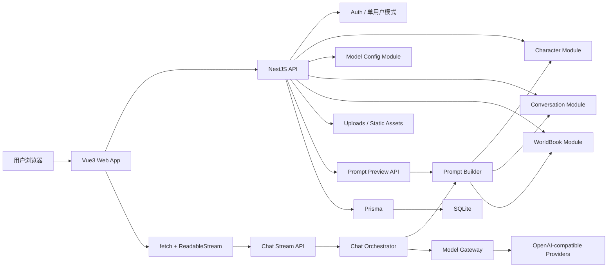

# Tavern Lite 架构说明

本文档描述 Tavern Lite 的高层模块、阶段路线和实施顺序。当前文档服务第 0 阶段，不包含业务代码实现。

## 1. 架构目标

Tavern Lite 的架构目标是支撑一个轻量、自托管、可分阶段开发的 AI 角色对话 Web MVP。

优先级从高到低：

1. 完成角色对话闭环。
2. 保证 Prompt 构建路径唯一、可预览、可解释。
3. 保证模型调用集中在后端 Model Gateway。
4. 使用 SQLite 降低本地部署和备份成本。
5. 保持模块边界清晰，方便后续阶段逐步扩展。

## 2. 高层模块图



核心约束：

- Web 前端只通过后端 API 工作。
- Prompt Preview 和 Chat Stream 复用同一个 Prompt Builder。
- Chat Orchestrator 负责编排消息落库、Prompt 构建、模型调用和流式输出。
- Model Gateway 是唯一供应商调用出口。
- Prisma 是唯一数据库访问入口。

## 3. 前端模块

前端使用 Vue 3 + Vite + TypeScript + Pinia + Vue Router + Naive UI。

计划模块：

- `pages/characters`：角色列表、创建、编辑、详情。
- `pages/model-configs`：模型配置、连接测试。
- `pages/conversations`：会话列表和聊天页。
- `pages/prompt-preview`：Prompt 预览与组成解释。
- `pages/worldbook`：世界书和命中调试。
- `pages/settings`：本地设置、备份恢复入口。
- `api/`：REST 和流式接口封装。
- `stores/`：用户态、模型配置、角色、会话等状态。
- `composables/useChatStream`：聊天流解析、停止生成、错误处理。

前端边界：

- 不保存 API Key 明文。
- 不直接调用模型供应商。
- 不硬编码 Prompt。
- 不解析供应商原始响应。

## 4. 后端模块

后端使用 NestJS + TypeScript + Prisma + SQLite。

计划模块：

- `auth`：单用户模式或简单登录。
- `character`：角色 CRUD、头像、角色卡导入导出。
- `model-config`：模型配置、API Key 写入和掩码读取、连接测试。
- `conversation`：会话 CRUD、标题、列表分页。
- `message`：消息写入、编辑、删除、复制、重新生成依赖。
- `persona`：用户 Persona。
- `prompt-preset`：参数预设和输出风格约束。
- `worldbook`：世界书、条目、关键词匹配、命中调试。
- `prompt-builder`：唯一 Prompt 构建入口。
- `model-gateway`：OpenAI-compatible provider 适配。
- `chat`：`POST /api/chat/stream` 编排与 SSE 输出。
- `uploads`：头像、JSON 导入、静态资源访问。
- `backup`：SQLite 与 uploads 的备份恢复。
- `settings`：本地配置。

后端边界：

- Controller 不写复杂业务。
- Service 不直接返回任意 HTTP 结构。
- 模型供应商调用不得散落在业务模块。
- 数据库写入必须通过 Prisma。
- API Key 不进入前端响应、日志或 Prompt。

## 5. 数据与存储

首版存储选择：

- SQLite：业务数据、消息、配置、世界书。
- 本地文件系统：头像、导入文件、备份文件。
- Prisma migration：数据库结构演进。

关键实体方向：

- User 或单用户配置。
- Character。
- CharacterAsset。
- ModelConfig。
- PromptPreset。
- UserPersona。
- Conversation。
- Message。
- WorldBook。
- WorldBookEntry。
- AppSetting。

SQLite 约束：

- 按低并发单机使用设计。
- 避免长事务。
- 同一会话生成期间加并发保护。
- 备份恢复必须同时考虑 SQLite 文件和 uploads 目录。

## 6. Prompt Builder 路线

Prompt Builder v1 只做必要闭环：

1. 平台基础规则。
2. 角色卡。
3. 用户 Persona。
4. 参数预设。
5. 世界书关键词命中条目。
6. 最近历史消息。
7. 当前用户输入。
8. 输出约束。

v1 不做：

- 长期记忆摘要。
- 向量召回。
- 递归世界书。
- 多角色群聊编排。
- 自动角色代理。

Prompt 预览必须展示 Builder 的真实输出和组成来源，不允许另写一套预览逻辑。

## 7. Model Gateway 路线

首版 Model Gateway 只要求 OpenAI-compatible Chat Completions。

统一输入：

- `model`
- `messages`
- `temperature`
- `maxTokens`
- `stream`
- 其他白名单参数

统一输出：

- 非流式测试响应。
- 流式 delta。
- 统一错误码。
- 供应商元数据的安全子集。

后续可扩展：

- OpenAI Responses API 适配。
- 更多供应商参数映射。
- 本地模型代理。

扩展不得破坏业务层只依赖 Gateway 的约束。

## 8. SSE 聊天路线

聊天流固定使用 POST：

```text
POST /api/chat/stream
```

原因：

- 聊天请求需要 JSON body。
- 原生 `EventSource` 不适合发送 POST body。
- `fetch` + `ReadableStream` 可以保留 POST 语义，同时解析 SSE 文本帧。

后端事件：

- `delta`：模型增量文本。
- `done`：生成完成。
- `error`：统一错误。
- `ping`：可选心跳。

必须先做：

1. 统一响应和错误码。
2. Message 数据模型。
3. Prompt Builder。
4. Model Gateway。
5. Chat Orchestrator。

之后再做：

- 停止生成。
- 重新生成。
- 编辑、删除、复制消息。
- 流式失败恢复策略。

## 9. 阶段路线

阶段顺序以 `model-context/stages` 为参考，执行时必须保持依赖关系。

| 阶段 | 目标 | 必须先完成 |
| --- | --- | --- |
| 0 | 项目规则冻结与文档初始化 | 无 |
| 1 | Monorepo 初始化 | 阶段 0 |
| 2 | Vue3 前端基础工程 | 阶段 1 |
| 3 | NestJS 后端基础工程 | 阶段 1 |
| 4 | Prisma + SQLite 接入 | 阶段 3 |
| 5 | 数据库 schema 初版 | 阶段 4 |
| 6 | seed 数据 | 阶段 5 |
| 7 | 单用户模式与简单登录 | 阶段 3、5 |
| 8 | 统一 API 响应与错误处理 | 阶段 3 |
| 9-13 | 角色 API、列表、创建编辑、详情、头像上传 | 阶段 5、8 |
| 14-16 | 模型配置 API、页面、连接测试 | 阶段 5、8 |
| 17-20 | 预设与 Persona | 阶段 5、8 |
| 21-24 | 会话、消息、聊天 UI 骨架 | 阶段 5、8、角色域 |
| 25-28 | Prompt Builder 类型、实现、预览 API 与页面 | 角色、Persona、消息 |
| 29-33 | Model Gateway、OpenAI-compatible、SSE 聊天、前端流接入 | Prompt Builder、模型配置 |
| 34-36 | 停止生成、重新生成、消息操作 | SSE 聊天 |
| 37-40 | 世界书 API、编辑、匹配、调试集成 | Prompt Builder |
| 41-45 | 导入导出、设置页 | 核心数据模型稳定 |
| 46-48 | Docker Compose、静态托管、备份脚本 | MVP 功能稳定 |
| 49-50 | 回归测试、MVP 验收 | 全部核心阶段 |

## 10. 必须先做什么后做什么

必须先做：

- 先定规则，再写代码。
- 先工程骨架，再业务模块。
- 先数据库 schema，再 API CRUD。
- 先统一响应，再前端请求封装。
- 先 Prompt Builder 类型和预览，再聊天流。
- 先 Model Gateway，再任何供应商调用。
- 先消息持久化，再重新生成和编辑删除。
- 先世界书基础 CRUD，再做命中调试。
- 先备份恢复方案，再生产部署说明。

禁止反序：

- 未有 Gateway 就在聊天接口直连供应商。
- 未有 Builder 就在组件或 service 中拼 Prompt。
- 未有统一响应就批量写前端 API 封装。
- 未有 schema 就实现复杂页面状态。
- 未有核心聊天闭环就实现支付、市场、机器人、TTS、图片生成、向量库。

## 11. 当前阶段交付物

第 0 阶段交付物：

- `AGENTS.md`
- `README.md`
- `docs/architecture.md`

第 0 阶段不交付：

- 前端工程。
- 后端工程。
- 数据库 schema。
- 业务 API。
- 页面组件。
- 依赖安装。
- 运行脚本。

## 12. 风险与控制

主要风险：

- 文档规则过泛，后续阶段无法执行。
- 提前引入非 MVP 功能导致范围失控。
- Prompt 拼装散落在多个模块。
- 模型调用绕过 Gateway。
- API Key 被前端、日志或 Prompt 泄漏。
- SSE 被误用为 `EventSource` GET 请求，无法携带聊天 body。

控制方式：

- 每阶段先检查 `AGENTS.md`。
- 任务完成后按固定格式汇报改动、验证、缺口和 TODO。
- 涉及 Prompt、Gateway、SSE、SQLite、API Key 的改动必须在评审中单独说明。
- 对超出 MVP 的需求先标记为后续阶段，不直接实现。

